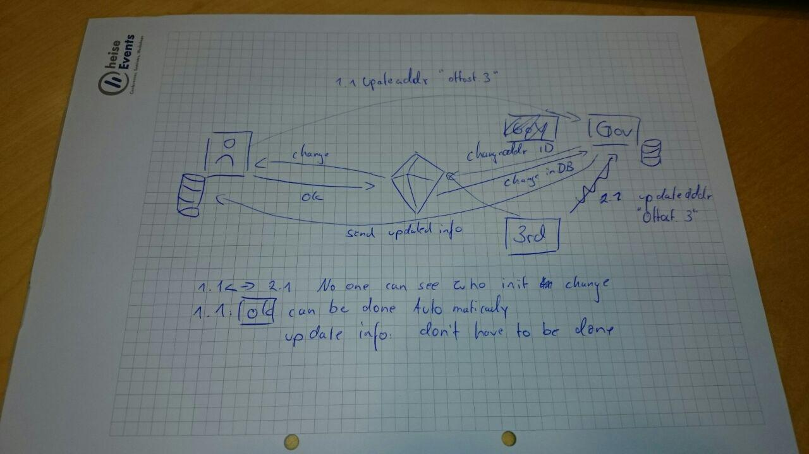
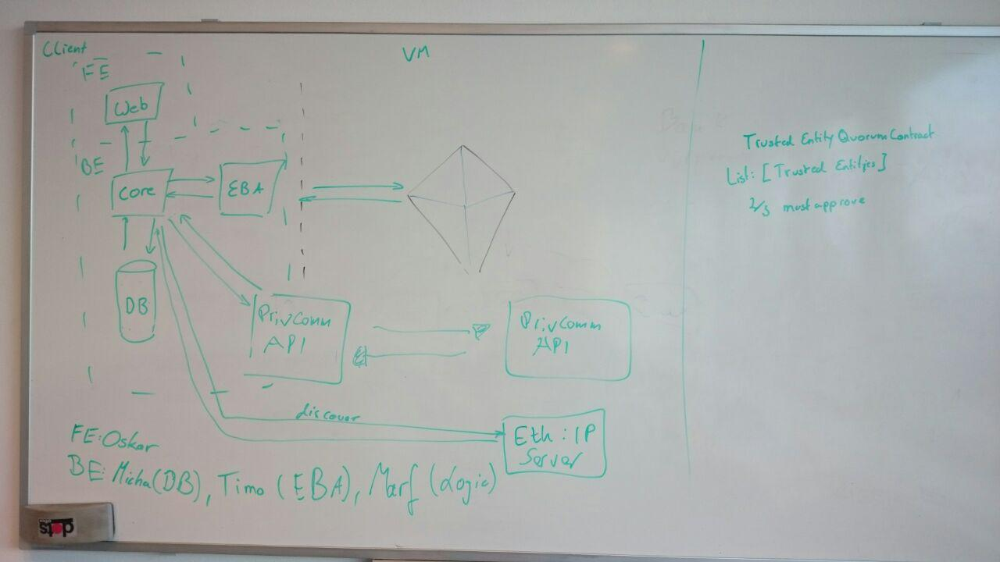

Date: ```19.11.2017```

# Attendance
  * Timo
  * Marvin
  * Michael

# Discussion use-cases
  * Change Attribute concept (Marvin)

    * Presented first draft of change process
    * Further work required as not tamper-proof yet
  * Registration / PPR (Micha)
  * Closures (Timo)


# Technology Concept


  * Frontend:  ```Oskar```
    * neither seashell nor eggshell as a color (and no mix of them)
  * Backend:
    * Java based but specific library/project yet to be named
    * Database: ```Micha```
      * Interface between Logic and DB
      * SQLite probably (locally stored data)
    * Ethereum Blockchain Adapter: ```Timo```
      * Interface between core logic and EBA
      * EBA
    * Core/Logic: ```Marvin```
      * All the logic
  * Smart contracts: ```All```
  * IP-Address register is still to be determined
    * maps eth-address and corresponding public key to ip address
    * required for private communication between entities (off-chain communication)
    * distributed hash-table?
    * MQTT?
    * written data can be verified by using the originally established entitity (registrar contract)

# ToDo
## Everyone
  * complete epics

## Oskar
  * summarize MedRec paper

## Micha
  * Write down use cases that describe the models
